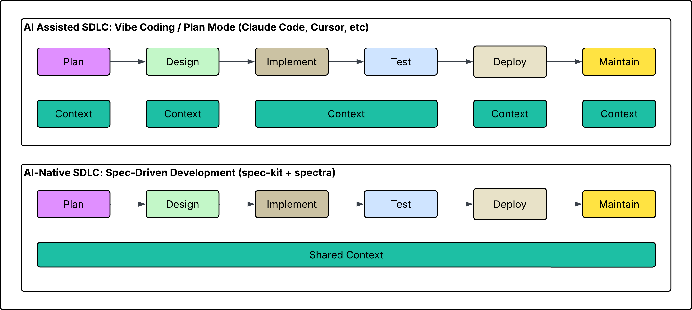
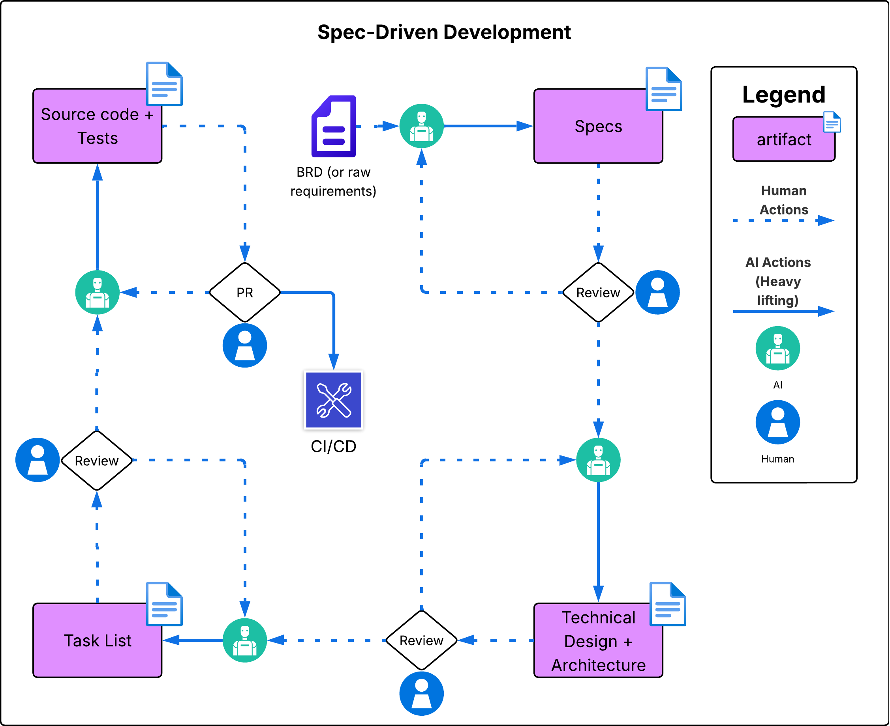
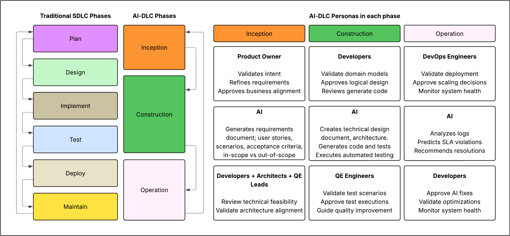

<div align="center">


# SPECTRA

**Agentic software engineering across the entire SDLC**

<sub>A curated catalog of [Spec Kit](https://github.com/github/spec-kit) extensions that enable full agentic development across the entire software development lifecycle.</sub>

</div>

---

## Table of Contents

- [AI-Assisted VS AI-Native](#ai-assisted-vs-ai-native)
- [Spec-Driven Development](#spec-driven-development)
- [AI-DLC](#ai-dlc)
- [Agents](#agents)
- [Security, policy, and compliance](#security-policy-and-compliance)
- [Installation](#installation)
  - [Installer (recommended)](#installer-recommended)
  - [Manual](#manual)
- [Two release channels](#two-release-channels)
- [License](#license)

---

Spectra **builds on top of** [](https://github.com/github/spec-kit) — it does not replace it.
Spec Kit gives you spec-driven development (`specify`, `plan`, `tasks`, `implement`); Spectra adds
focused, production-ready agents for the work that surrounds the code: architecture decisions, design,
quality gates, documentation, delivery, and more. These capabilities ship together as a single
self-contained Spec Kit extension, `spectra`, whose commands all live under the `speckit.spectra.*`
namespace. You install Spec Kit first, then add the Spectra extension onto any Spec Kit project.

Spectra is built and maintained by TELUS Digital.

> **Who this README is for — developers.** It covers two paths:
>
> - **Consumers** — engineers and teams who want to install and use the Spectra extension in their Spec
>   Kit projects. That's everything below.
> - **Contributors** — engineers adding or changing a command. Start at
>   [CONTRIBUTING.md](CONTRIBUTING.md); this README only points you there.

> 📚 **New to spec-driven development and Spec Kit?** We've built a course handbook for you:
> **[Spec-Driven Development — Course Handbook](https://expert-adventure-77nryn7.pages.github.io/e-learning/)**.

## AI-Assisted VS AI-Native
Vibe coding and plan mode — Claude Code, Cursor, and the rest — supercharge a single phase. But each phase runs in its own session: the agent rebuilds its understanding from scratch every time, and the spec, design, tests, and code drift apart at every hand-off. That's AI-assisted — a faster typist. True AI-native engineering keeps one context intact across the whole lifecycle, so every phase builds on the last instead of starting cold.



SPECTRA makes spec-driven development truly AI-native. Every phase reads and writes one shared, durable context — the spec, plan, design, tasks, and code stay in lockstep through a tight, repeating loop, with a human owning the gate at each step. Because that context is shared, every agent stays in full compatibility with the standards and guardrails set for the system — nothing drifts out of policy from one phase to the next. Continuity is the design goal; speed and quality follow from it.

## Spec-Driven Development

Spec-Driven Development flips the script on traditional software development. For decades, code has
been king — specifications were just scaffolding we built and discarded once the "real work" of
coding began. Spec-Driven Development changes this: specifications become executable, directly
generating working implementations rather than just guiding them.

Spec Kit runs that loop in four core phases:

```text
spec  →  plan  →  tasks  →  implement
```



Spec Kit ships the **skeleton** — the core spec-driven loop above. **Spectra builds on top of it**,
adding specialized agents across every phase of the SDLC: foundation and governance, requirements,
architecture, planning, implementation, testing, and delivery.

## AI-DLC

**AI-DLC** is AWS's [AI-Driven Development Life Cycle](https://aws.amazon.com/blogs/devops/ai-driven-development-life-cycle/)
— introduced to fix a structural limit of the traditional SDLC: it's built around **humans**, with AI
bolted on at the edges. AI-DLC inverts that and puts **AI at the centre** — AI drafts the plan and does
the heavy lifting, while humans review and approve at each gate. It collapses the classic SDLC phases
into three: **Inception → Construction → Operation**.



That is exactly the Spectra model. Spectra already runs this way on a conventional SDLC, and it's
**ready for AI-DLC out of the box**: its loop, shared context, and human gates map straight onto
AI-DLC's three phases — so adopting Spectra is itself how a team makes the shift, without giving up
the discipline that keeps quality high. Inside every phase the same pattern repeats — **the team
validates at a gate, AI drafts and builds, the team reviews** — and the same agents from the
[roster below](#agents) slot straight into each phase:

## Agents

Every Spectra roster is built from two kinds of agents — a required **core** that runs the SDLC
end-to-end, plus optional **add-ons** you switch on as the domain demands. The roster spans the SDLC
phases below, each also mapped onto the [**AI-DLC**](#ai-dlc) phases (Inception → Construction → Operation).

**Status:** ✅ available today · 🚧 under development.

<!-- SPECTRA:GENERATED START id=readme-agents-table -->
<!-- Generated from agents-list.json — do not edit by hand. Run: python tools/generate_agent_docs.py -->

| Agent | SDLC phase | AI-DLC phase | Type | Status |
| ----- | ---------- | ------------ | ---- | ------ |
| Guardrails | Foundation | Inception | Core | ✅ available |
| Domain Analyzer | Foundation | Inception | Add-on | ✅ available |
| FDA 21 CFR Part 11 & IEC 62304 | Foundation | Inception | Add-on | 🚧 under dev |
| ISO 27001 / 27701 | Foundation | Inception | Add-on | 🚧 under dev |
| Requirements Analyst | Requirements & Discovery | Inception | Core | ✅ available |
| BRD Generator | Requirements & Discovery | Inception | Add-on | ✅ available |
| Clarifier | Requirements & Discovery | Inception | Add-on | ✅ available |
| Requirements Quality | Requirements & Discovery | Inception | Add-on | ✅ available |
| GDPR Compliance | Requirements & Discovery | Inception | Add-on | 🚧 under dev |
| Canadian Privacy — PIPEDA / PHIPA / Law 25 | Requirements & Discovery | Inception | Add-on | 🚧 under dev |
| EU AI Act & Responsible-AI Governance | Requirements & Discovery | Inception | Add-on | 🚧 under dev |
| Legal-Obligation Extraction | Requirements & Discovery | Inception | Add-on | 🚧 under dev |
| Architecture Planner | Architecture & Design | Construction | Core | ✅ available |
| Architecture Decision Records (ADR) | Architecture & Design | Construction | Add-on | ✅ available |
| Architecture Reviewer | Architecture & Design | Construction | Add-on | 🚧 under dev |
| HIPAA Compliance | Architecture & Design | Construction | Add-on | 🚧 under dev |
| PCI-DSS | Architecture & Design | Construction | Add-on | 🚧 under dev |
| Threat Modeling | Architecture & Design | Construction | Add-on | 🚧 under dev |
| Performance & Scalability | Architecture & Design | Construction | Add-on | 🚧 under dev |
| Data Governance & Privacy Engineering | Architecture & Design | Construction | Add-on | 🚧 under dev |
| API Design & Contract | Architecture & Design | Construction | Add-on | 🚧 under dev |
| Task Planner | Planning | Construction | Core | ✅ available |
| Consistency | Planning | Construction | Add-on | ✅ available |
| Implementation | Implementation | Construction | Core | ✅ available |
| Dependency & Supply-Chain | Implementation | Construction | Add-on | 🚧 under dev |
| Database & Data-Layer | Implementation | Construction | Add-on | 🚧 under dev |
| Documentation Quality | Implementation | Construction | Add-on | 🚧 under dev |
| Technical-Debt & Maintainability | Implementation | Construction | Add-on | 🚧 under dev |
| Testing | Testing & Quality | Construction | Core | ✅ available |
| Test Coverage Analyst | Testing & Quality | Construction | Add-on | 🚧 under dev |
| Test Automation Analyst | Testing & Quality | Construction | Add-on | 🚧 under dev |
| Security Analyst | Testing & Quality | Construction | Add-on | 🚧 under dev |
| Accessibility & WCAG Compliance | Testing & Quality | Construction | Add-on | 🚧 under dev |
| Carbon & Green-Software | Testing & Quality | Construction | Add-on | 🚧 under dev |
| Internationalization Readiness | Testing & Quality | Construction | Add-on | 🚧 under dev |
| Responsible-AI & Bias | Testing & Quality | Construction | Add-on | 🚧 under dev |
| GitHub (PR) | Deployment & Operations | Operation | Core | ✅ available |
| Review PR | Deployment & Operations | Operation | Core | ✅ available |
| Operations Monitor | Deployment & Operations | Operation | Add-on | 🚧 under dev |
| Incident Responder | Deployment & Operations | Operation | Add-on | 🚧 under dev |
| SOC 2 | Deployment & Operations | Operation | Add-on | 🚧 under dev |
| SOX Change-Management | Deployment & Operations | Operation | Add-on | 🚧 under dev |
| Infrastructure-as-Code Analysis | Deployment & Operations | Operation | Add-on | 🚧 under dev |
| Cost & FinOps | Deployment & Operations | Operation | Add-on | 🚧 under dev |
| Observability Readiness | Deployment & Operations | Operation | Add-on | 🚧 under dev |

The agents marked ✅ that aren't shipped by Spectra (Guardrails, Requirements Analyst, Clarifier,
Requirements Quality, Architecture Planner, Task Planner, Consistency, Implementation, Testing) are
Spec Kit's own core commands — Spectra layers on top of them.
<!-- SPECTRA:GENERATED END id=readme-agents-table -->

Full details for every agent — what it does, its arguments, and how to run it — live in
**[AGENTS_LIST.md](AGENTS_LIST.md)**.

## Security, policy, and compliance

**Spectra introduces no new trust boundary.** It is not another AI vendor, not another model, and not
another data path. Spectra ships as *instructions* — Markdown command files that Spec Kit registers
with the AI coding agent your organization has already approved. Those instructions are executed **by
that agent**, inside your existing environment. Whatever governs the agent therefore already governs
Spectra.

### Your controls, inherited unchanged

| Your existing control | How it applies to Spectra |
|---|---|
| Approved AI vendor and model | Unchanged — Spectra adds no model and makes no inference calls of its own. |
| Data handling, residency, and retention | Unchanged — prompts and source travel the agent's existing path, never a Spectra one. |
| Identity, SSO, and access control | Unchanged — Spectra holds no credentials of its own. `create-pr` uses your existing `git` / `gh` login, and confirms before any push. |
| Network egress, proxy, and DLP | Unchanged — Spectra opens no channel the agent does not already use. |
| Audit and logging | Unchanged — agent activity is captured exactly as it was before. |

Because those controls sit on the *tool* rather than on Spectra, **they cascade automatically**. There
is no second policy to author, no second vendor assessment to run, and no path by which Spectra can
operate outside the boundary the agent is already held to.

### The same holds for any agent

The model is deliberately tool-agnostic. A team standardized on **Claude** gets agentic SDLC coverage
under the rules already approved for Claude. A client running **Kiro**, **Gemini**, **Copilot**,
**Cursor**, or any other agent Spec Kit supports gets the same capabilities under *their* approvals.

Commands are authored once in Spec Kit's generic format and translated into each agent's native form
at install time, so the governing tool changes while Spectra does not. Governance travels with the
tool the organization chose — which is precisely why adopting Spectra does not reopen a compliance
review.

### What Spectra adds on top

Inheriting the perimeter is the floor, not the ceiling. Spectra is also built to make policy
*enforceable* rather than aspirational:

- **Standards encoded once.** The Guardrails agent writes your coding, security, and architecture
  standards into the project constitution, and every downstream agent inherits them — so a standard
  is applied by construction instead of by memory.
- **A human gate at every phase.** No phase advances without explicit approval. AI drafts and builds;
  people decide.
- **Traceability by default.** Spec, plan, tasks, and code stay linked in one shared context, so any
  change can be traced back to the intent that authorized it.
- **Dedicated compliance agents.** The roster covers GDPR, HIPAA, SOC 2, PCI-DSS, ISO 27001/27701,
  SOX, the EU AI Act, Canadian privacy (PIPEDA / PHIPA / Law 25), FDA 21 CFR Part 11 / IEC 62304, and
  WCAG. **Most are still under development** — check the [status column](#agents) before depending on
  one.

### Supply chain

- **Markdown only.** The published extension is four command files, one template, and its licence,
  notice, and changelog. No scripts, no binaries, no post-install hooks. Read it yourself at
  [`spectra/`](spectra/) or inside [`docs/packages/spectra.zip`](docs/packages/spectra.zip).
- **No telemetry.** The `spectra` command reports nothing about you, your code, or your project. Its
  only network calls are bodyless `GET` requests to `api.github.com` and `raw.githubusercontent.com`,
  reading the published catalog, agent roster, and latest release number. Set
  `SPECTRA_NO_UPDATE_CHECK=1` (or pass `--no-update-check`) to switch the release check off entirely.
- **No credentials to grant.** The catalog is public — no GitHub login, no token, no `gh` setup.
- **Auditable and pinnable.** Apache-2.0 with the source in the open, and every extension pins the
  Spec Kit version it was tested against (`requires.speckit_version`). Commit
  `.specify/extension-catalogs.yml` and the resolved source travels with the repository.

## Installation

Spectra installs **into** a Spec Kit project, and its catalog is **public** — there's no GitHub login
or token involved either way. Pick one path: the **Installer** does everything for you, or
**Manual** walks you through it step by step.

### Installer (recommended)

The recommended path — **you don't need to clone this repo.** Spectra ships as a
[`uv`](https://docs.astral.sh/uv/) tool. Install it once, from anywhere:

```bash
uv tool install spectra-cli --from git+https://github.com/xavient/spectra
```

That puts a `spectra` command on your `PATH`. Then `cd` into the project you want Spectra in and run
the install:

```bash
spectra install
```

(Bare `spectra` just prints the banner and points at `--help` — it never touches the current folder.
`install` is the verb that does the work.)

It installs the `specify` CLI if it's missing (at the latest Spec Kit release), offers to run
`specify init` if the current folder isn't a Spec Kit project yet, registers the Spectra catalog, and
installs every extension the catalog advertises. It works on macOS, Linux, and Windows.

When it finishes, **restart your AI agent** to pick up the new commands.

<details>
<summary>Don't have <code>uv</code> yet?</summary>

```bash
# macOS / Linux
curl -LsSf https://astral.sh/uv/install.sh | sh

# Windows (PowerShell)
powershell -ExecutionPolicy ByPass -c "irm https://astral.sh/uv/install.ps1 | iex"
```

Open a new terminal afterwards so `uv` is on your `PATH`. See the
[uv installation docs](https://docs.astral.sh/uv/getting-started/installation/) for package-manager
alternatives.

</details>

#### Working with your agents

Once Spectra is installed, the **top-level commands act on the agents in the project you're standing
in**:

```bash
spectra agent-list   # every agent Spectra offers, grouped by SDLC phase (works anywhere)
spectra check        # is Spectra installed in this project? offers to install it if not
spectra version      # is my whole stack current? checks all four components
spectra update       # bring every out-of-date component current, after one confirmation
spectra uninstall    # remove the agents from this project; the command stays on your machine
```

`spectra agent-list` reads the published roster at run time, so a newly published agent shows up
without you updating anything.

#### Keeping everything up to date

Two commands cover the whole stack. `spectra version` reports it; `spectra update` fixes it:

```bash
spectra version   # is every part of my stack current?
spectra update    # bring every out-of-date part current, after one confirmation
```

Both check **four** things, because all four have to be current for Spectra to work:

| Component | What it is |
|---|---|
| Specify CLI | Spec Kit's own `specify` command |
| Core agents | the Spec Kit integration installed in `.specify/` |
| Spectra CLI | the `spectra` command itself |
| Spectra agents | the Spectra extension installed in this project |

```text
Specify CLI:     ✓ up to date (0.16.4)
Core agents:     ! needs updating (0.12.14 -> 0.16.4)
Spectra CLI:     ✓ up to date (6.0.0)
Spectra agents:  ✓ up to date (1.3.1)

  You can update by running: spectra update
```

Anything that can't be checked — no network, no `specify` on `PATH` — is reported as `unknown` rather
than guessed at, and `spectra update` skips it instead of acting on a state it couldn't establish.

Managing the **tool itself** is down to one verb, since `version` and `update` now cover it:

```bash
spectra cli uninstall   # remove the spectra command from this machine
```

> **Changed in 6.0.0.** `spectra cli version` and `spectra cli update` were retired. They reported on
> and updated the `spectra` command alone, which is only a quarter of what has to be current — so
> `spectra version` and `spectra update` absorbed them and now cover all four components. Run either
> retired command and it tells you which replacement you want. `spectra cli uninstall` is unchanged.

> **Changed in 5.0.0.** `--version`, `--update`, and `--uninstall` were removed. They reported on the
> *tool*, which is the number you're least likely to care about. Run one and it tells you which
> replacement you want.

**The command and the extensions still release separately** — and that's deliberate. New agents reach
you through the catalog, not through a new `spectra` release. What changed in 6.0.0 is only that one
command now *reports and updates* both, instead of making you run two.

See [Two release channels](#two-release-channels) for why.

`spectra cli uninstall` removes the `spectra` command only. Extensions already installed into your
projects are left untouched — remove those with `specify extension remove spectra`.

### Manual

Prefer to wire it up by hand (or `uv` isn't an option for you)? Because the catalog is public,
there's nothing to authenticate — no GitHub token, no `gh` login.

**1. Install the `specify` CLI (Spec Kit).** Spectra installs into a Spec Kit project, so you need Spec
Kit first — follow the [Spec Kit installation guide](https://github.com/github/spec-kit#-get-started)
(it uses [`uv`](https://docs.astral.sh/uv/)), then verify it's on your `PATH`:

```bash
specify --version
```

**2. Initialize a Spec Kit project** (or use an existing one). This creates the `.specify/` directory
and registers Spec Kit's commands for your coding agent:

```bash
specify init               # in a new directory, or `specify init .` in an existing one
```

Run the next step — and every Spectra command — from **inside** that project (a folder containing
`.specify/`). New to spec-driven development? Read the [Spec Kit docs](https://github.github.io/spec-kit/)
first — Spectra assumes you're comfortable with the `specify → plan → tasks → implement` loop.

**3. Add the Spectra catalog.** Point Spec Kit at the public catalog so `search` / `add` / `update`
resolve against it:

```bash
specify extension catalog add \
  https://raw.githubusercontent.com/xavient/spectra/main/catalog.json \
  --name spectra --priority 5 --install-allowed
```

`--install-allowed` is required — catalogs are discovery-only by default, which blocks
`specify extension add` from installing anything in them. This writes the catalog into
`.specify/extension-catalogs.yml`:

```yaml
catalogs:
  - name: "spectra"
    url: "https://raw.githubusercontent.com/xavient/spectra/main/catalog.json"
    priority: 5
    install_allowed: true
```

**Commit `.specify/extension-catalogs.yml`** so everyone who clones the project inherits the catalog —
no per-developer setup. (Prefer not to touch project config? Set `SPECKIT_CATALOG_URL` to the same URL
to use Spectra everywhere.)

**4. Install and use the extension.**

```bash
specify extension search          # find the Spectra extension
specify extension add spectra     # install spectra and register all its commands with your agent
specify extension list            # show what's installed, with status and version
specify extension update spectra  # pull a newer version when we publish one
specify extension remove spectra  # uninstall (configs are backed up by default)
```

Spectra ships as a **single extension** — `specify extension add spectra` registers every
`speckit.spectra.*` command at once (run `spectra agent-list` to see them). After installing,
**restart your AI agent** so it picks up the new commands, then run one. On Claude:

```
/speckit-spectra-adr We should standardize on PostgreSQL for all primary data stores
```

Spec Kit translates each command into your agent's native format at install time, so the extension
supports every agent — but the **trigger you type differs by agent**. Every Spectra command lives
under the unified `speckit.spectra.*` namespace (e.g. `speckit.spectra.adr` in the manifest), and how
you invoke it depends on how your agent registers it:

- **Claude** installs commands as *skills*, invoked with a leading slash and dashes: `/speckit-spectra-adr ...`.
- **Other agents** register it under a slightly different trigger — e.g. kiro-cli keeps the dots:
  `/speckit.spectra.adr ...`.

The examples in this README use Claude's form; adjust the trigger for your agent.

After install, the CLI prints the provided commands, and `specify extension info spectra` (or your
agent's own command/skill list) shows the exact triggers to use.

The extension has its own README with full per-command usage details — see [`spectra/`](spectra/README.md).

## Two release channels

Spectra ships two things, and they carry **two different version numbers on purpose**:

| | The `spectra` CLI | The `spectra` extension |
|---|---|---|
| What it is | the uv tool that sets everything up | the agents your AI assistant runs |
| You install it with | `uv tool install spectra-cli --from git+…` | `specify extension add spectra` |
| You update it with | `spectra update` (or `spectra cli uninstall` to remove it) | `spectra update` (or `specify extension update spectra`) |
| Its version comes from | the latest [GitHub Release](https://github.com/xavient/spectra/releases) | `version` in [`catalog.json`](catalog.json) |

They are **not** expected to match, and a bump to one does not imply a bump to the other. Adding a new
agent bumps the extension only — you do **not** need a new `spectra` command to get it, because the
command reads the live catalog every time it runs. Changing the setup flow bumps the command only.

Git tags and GitHub Releases on this repo belong to the **command** channel; the extension is
published continuously from `main` over raw URLs and is never tagged. Both current versions are shown
live on the [Spectra landing page](https://xavient.github.io/spectra/).

## License

Apache License 2.0 — see [LICENSE](LICENSE). The `spectra` extension carries its own copy of the
license too.

Spectra is free to use, modify, and redistribute, commercially or otherwise. Attribution is
required: if you redistribute Spectra or a derivative work, keep the copyright notice, the `LICENSE`,
and the [`NOTICE`](NOTICE) file, and state which files you changed. See sections 4(b)–4(d) of the
license.
